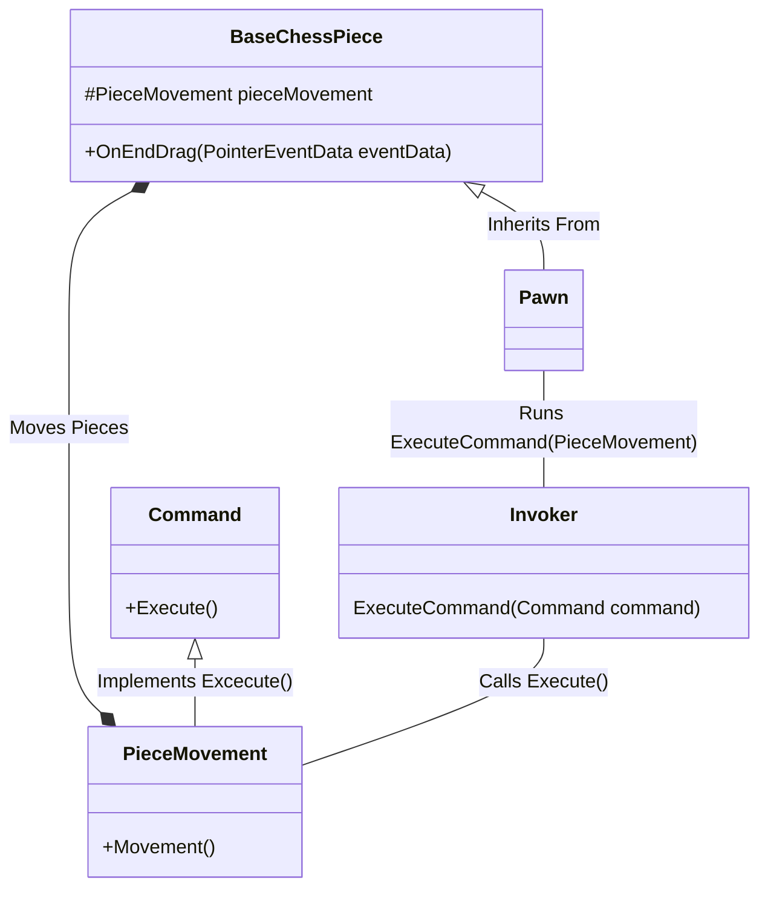

# Game_Engine_Assignment_1

## Team Members and Roles
Jeffry Lai (100698915) - Since I'm doing this assignment by myself, I am responsible for everything in the assignment.

## Contribution
Jeffry Lai - 100%
## Purpose
I am recreating the game of chess and applying the Singleton Design Pattern, Command Design Pattern, Factory Design Pattern, and Observer Design Pattern to the mechanics of chess.

## Resources Used/Credits
Chess sprites taken from https://greenchess.net/info.php?item=downloads

## Gererative AI Disclaimer
I used ChatGPT as a glorified Google search engine, allowing me to type full questions and iterate to get the what I am looking for. For example, I needed to get a function that allows me to interact with my pieces with the mouse pointer clicks and ChatGPT gave me the function ```OnDrag(PointerEventData eventData)```. Due to the way I have designed my game, I had no choice but to modify the results returned to me such as for my ```OnEndDrag(PointerEventData eventData)``` function where I modified the use of raycasting to fit into my game. Deeper explanation on where I did this and how I changed it are below:

### ChatGPT For Examples and as a Reference.
I have used ChatGPT as a reference for design patterns and asked it to provide me examples of desing patterns being implemented in Unity using Chess as the game. Due to the way I've designed my game, none of the examples or responses ChatGPT gave could've been copied even if I wanted to. The purpose was to get ideas or to help with properly implementing the design patterns and the use of ChatGPT was helpful in doing so. For transparency, the following are some prompt questions I asked ChatGPT:
- In Unity, use the command design pattern to move chess pieces from one tile to another.
- In unity, how do I use the observer design pattern to promote a chess pawn.

### Dragging Pieces For The Player to Move Them.
I asked ChatGPT how I can move game object by clicking and dragging them it returned the function ```OnDrag(PointerEventData eventData)``` from IDragHandler interface, however I modified the code to move the pieces with my mouse pointer and made sure it can only happen if it is the player's turn. The same was done with ```OnEndDrag(PointerEventData eventData)``` from IEndDragHandler but with collider detecting which will be explained below.

### Snapping The Pieces to Tiles (And Checking For Other Pieces)
I used ChatGPT to find the correct function to change my Raycast2D from only returning the first collider it hits to returning multiple (this is because it keeps returning the piece the ray came from which is useless). I added my own code for snapping by setting the parent of the UI object and resetting the rectTransform position then unparenting the object so it can be moved again.

## Explanation on Deliverables - Assignment 1

### Singleton
I created a ```GameManager``` that will be the singleton for this game. This was implemented by having the game manager check if there are already other game managers in the scene and deleting itself if there is.

#### Pseudocode
```csharp
GameManager _Instance

void Awake()
{
	if (_Instance != null && _Instance != this)
	{
		Destroy self;
	}
	_ Instance = this;

	// Rest of Awake()...
}
```
#### Explanation
I did this to ensure that there cannot be more than one ```GameManager```. I know that other examples shows that the ```_Instance = this``` is usually in an if statement that checks if the instance is null, however, I opted to reverse the logic as it fits in a programming style that reduces on if-else statements and nesting. This helps with ensuring there are not multiple ```GameManager```s overwritting data and also optimize code since each if-else takes computation time.

### Command Design Pattern
The command desgin pattern was used for the movement of the chess pieces. By encapsulating the command to move the pieces I created I allowed other chess pieces to use the same logic with minor changes (valid tiles to move to).

#### Diagram
The following is a UML diagram using the Pawn as an example.


#### Explanation
Since all chess pieces can move, the ```BaseChessPiece``` class has a variable that hold the ```PieceMovement``` class that will run the movement logic for all chess pieces. When the player stops dragging the pieces, the chess piece (in the diagram, it's the Pawn) will call the ```Invoker``` class's ```ExecuteCommand(Command command)``` method and pass the ```PieceMovement``` class as the command. The ```Invoker``` will call the ```PieceMovement```'s ```Execute``` method to move the pieces.

This implementation helps communicate between the base class and subclasses which wouldn't be possible before. The diagram didn't show this, however, the BaseChessPiece only has general logic for movement, but the subclasses have the logic for valid moves that the ```BaseChessPiece``` needs to ensure the pieces are moving correctly.

### Factory Pattern

#### Pseudocode/Diagram

#### Explanation

### Observer Pattern
The ```GameManager``` has been turned into an Observer that is subscribed to the ```Pawn``` (Subject) so that the ```GameManager```can promote the pawn.

#### Pseudocode/Diagram


#### Explanation


## Explanation on Deliverables - Course Project

### Assignment 1 Improvements
In truth, due to lack of everything in my Assignment 1, the only improvements I could make was actually completing Assignment 1.

### Optimization Design Patterns
I modified the Pawn and GameManager so that the Observer Design Pattern also functions as the Dirty Flag.

#### Pseudocode/Diagram


#### Explanation

### Plugin/DLL

#### Pseudocode/Diagram

#### Explanation

### Performance Profiling

#### Pseudocode/Diagram

#### Explanation
 